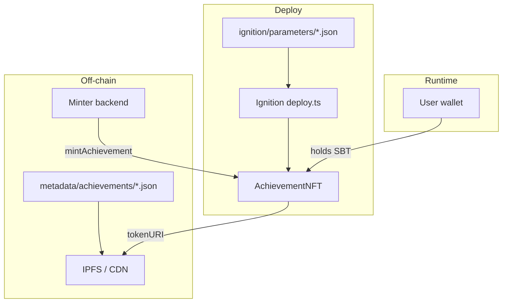

# AchievementNFT

On-chain **soulbound** (non-transferable) ERC-721 tokens that represent user **achievements**. Each token is tied to a recipient, a unique achievement type (`achievementKey`), and off-chain metadata referenced by `tokenURI`.

Built with **Hardhat 3**, **viem**, **OpenZeppelin Contracts 5.x**, and **Hardhat Ignition** for declarative deployments.

---

## Table of contents

- [Overview](#overview)
- [Features](#features)
- [Tech stack](#tech-stack)
- [Project structure](#project-structure)
- [Smart contract](#smart-contract)
  - [Roles](#roles)
  - [Achievement key](#achievement-key)
  - [Metadata](#metadata)
  - [Soulbound behavior](#soulbound-behavior)
  - [Public API](#public-api)
  - [Custom errors](#custom-errors)
- [Architecture diagram](#architecture-diagram)
- [Prerequisites](#prerequisites)
- [Installation](#installation)
- [Configuration and secrets](#configuration-and-secrets)
- [Running tests](#running-tests)
- [Deployment](#deployment)
  - [Parameter files](#parameter-files)
  - [Localhost (Hardhat Node)](#localhost-hardhat-node)
  - [Sepolia](#sepolia)
  - [Simulated networks (no live chain)](#simulated-networks-no-live-chain)
- [After deployment](#after-deployment)
- [Adding a new achievement type](#adding-a-new-achievement-type)
- [What is committed to Git](#what-is-committed-to-git)
- [Security notes](#security-notes)
- [License](#license)

---

## Overview

`AchievementNFT` is an ERC-721 collection where each NFT proves that an address earned a specific achievement. Typical use cases:

- Course or bootcamp completion badges
- Event participation proofs
- Platform milestones (first login, verified profile, etc.)

Unlike a normal NFT, achievements **cannot be sold or transferred**: they stay with the wallet that received them. The minter (backend or admin) calls `mintAchievement`; users only hold and display tokens.

---

## Features

| Feature | Description |
|--------|-------------|
| **ERC-721** | Standard NFT interface (`name`, `symbol`, `tokenURI`, `ownerOf`, …) |
| **Soulbound (SBT)** | No transfer, burn, or approvals after mint |
| **Per-user uniqueness** | One mint per `(address, achievementKey)` pair |
| **URI storage** | Each token has its own metadata URI (IPFS, HTTPS, etc.) |
| **Access control** | `DEFAULT_ADMIN_ROLE` and `MINTER_ROLE` |
| **Pausable** | Admin can pause minting in emergencies |
| **Ignition deploy** | Deploy contract + optional first mint in one module |
| **Network-specific params** | Separate parameter JSON for localhost vs Sepolia |

---

## Tech stack

| Component | Version / note |
|-----------|----------------|
| [Hardhat](https://hardhat.org/) | 3.x |
| [viem](https://viem.sh/) | Ethereum interactions in tests |
| [OpenZeppelin Contracts](https://docs.openzeppelin.com/contracts/) | 5.6.x — `ERC721`, `AccessControl`, `ERC721Pausable`, `ERC721URIStorage` |
| [Hardhat Ignition](https://hardhat.org/ignition) | Declarative deploy modules |
| [hardhat-toolbox-viem](https://hardhat.org/plugins/nomicfoundation-hardhat-toolbox-viem) | Tests, viem, Ignition, keystore |
| Runtime | Node.js, [Bun](https://bun.sh/) compatible (`bun` / `npm` / `npx`) |
| Solidity | `0.8.28` |

---

## Project structure

```
NFT/
├── contracts/
│   └── AchievementNFT.sol      # Main soulbound achievement token
├── test/
│   └── AchievementNFTTest.ts # Integration tests (node:test + viem)
├── ignition/
│   ├── modules/
│   │   └── deploy.ts           # Ignition module: deploy + mintAchievement
│   └── parameters/
│       ├── localhost.example.json
│       └── sepolia.example.json
├── metadata/
│   └── achievements/
│       └── FirstAchievement.json   # ERC-721 metadata template (off-chain)
├── hardhat.config.ts
├── package.json
├── tsconfig.json
├── .env.example                # Optional env vars (see keystore below)
└── README.md
```

Generated / local-only (gitignored):

- `artifacts/`, `cache/`, `coverage/`
- `ignition/deployments/` — deployment journals and addresses per chain
- `ignition/parameters/localhost.json`, `sepolia.json` — your real deploy values

---

## Smart contract

**File:** `contracts/AchievementNFT.sol`  
**Token:** `AchievementNFT` / `ACH`

### Roles

| Role | Set in constructor | Capabilities |
|------|-------------------|--------------|
| `DEFAULT_ADMIN_ROLE` | `msg.sender` | `pause` / `unpause`, `grantRole`, `revokeRole` |
| `MINTER_ROLE` | `msg.sender` | `mintAchievement` |

Deployer should grant `MINTER_ROLE` to a backend hot wallet or multisig and keep admin on a secure account.

### Achievement key

`achievementKey` is `bytes32` — an identifier for the **type** of achievement (not the token id).

- Uniqueness: `mapping(address => mapping(bytes32 => bool))` — each user can earn a given key only once.
- Recommended off-chain convention: `keccak256(abi.encodePacked("FirstAchievement"))` or `keccak256(bytes("FirstAchievement"))`.

Example (viem):

```ts
import { keccak256, stringToBytes } from "viem";

const achievementKey = keccak256(stringToBytes("FirstAchievement"));
// 0x85d616a2a7c31ac80e7e2808040b045312aaafba1ef8232954d4e71b71a011b2
```

Example (Foundry cast):

```bash
cast keccak "FirstAchievement"
```

### Metadata

1. **Source file** (in repo): `metadata/achievements/FirstAchievement.json` — human-readable ERC-721 JSON (`name`, `description`, `image`).
2. **Publish** that JSON to IPFS, Arweave, or HTTPS.
3. **On-chain:** `mintAchievement(..., metadataURI)` stores the URI via `_setTokenURI`. Wallets and marketplaces fetch JSON from that URI.

The contract does **not** embed JSON on-chain; it only stores the URI string.

### Soulbound behavior

Enforced in two layers:

1. **`_update` override** — if `from != address(0)`, mint/transfer/burn path reverts (blocks transfers and burns after mint).
2. **Explicit reverts** on `approve`, `setApprovalForAll`, `transferFrom`, `safeTransferFrom` with dedicated errors.

Minting still works (`from == address(0)`).

### Public API

| Function | Access | Description |
|----------|--------|-------------|
| `mintAchievement(to, achievementKey, metadataURI)` | `MINTER_ROLE`, not paused | Mints next `tokenId`, sets URI, emits `AchievementMinted` |
| `hasAchievement(owner, achievementKey)` | view | Whether user already has that achievement type |
| `getAchievementKey(tokenId)` | view | Key for a valid token id |
| `tokenURI(tokenId)` | view | Metadata URI |
| `pause()` / `unpause()` | `DEFAULT_ADMIN_ROLE` | Stop / resume minting |
| `grantRole` / `revokeRole` | `DEFAULT_ADMIN_ROLE` | Role management |

### Custom errors

| Error | When |
|-------|------|
| `AchievementNFT__AchievementAlreadyMinted` | Duplicate `(to, achievementKey)` |
| `AchievementNFT__InvalidMetadataURI` | Empty `metadataURI` |
| `AchievementNFT__InvalidTokenId` | `getAchievementKey` for non-existent id |
| `AchievementNFT__SoulboundTokenCannotBeTransferredOrBurned` | Transfer / burn / safeTransfer |
| `AchievementNFT__SoulboundTokenCannotBeApproved` | `approve` |
| `AchievementNFT__SoulboundTokenCannotBeApprovalForAll` | `setApprovalForAll` |

### Events

```solidity
event AchievementMinted(
  address indexed to,
  uint256 indexed tokenId,
  bytes32 indexed achievementKey,
  string metadataURI
);
```

---

## Architecture diagram



---

## Prerequisites

- **Node.js** 18+ (or Bun)
- **Git**
- For **Sepolia**: testnet ETH on the deployer/minter account
- For **localhost**: optional local `hardhat node`

---

## Installation

```bash
git clone <your-repo-url>
cd NFT
bun install
# or: npm install
```

Compile contracts:

```bash
bunx hardhat compile
```

---

## Configuration and secrets

Network secrets use Hardhat 3 **configuration variables** (keystore or env). Never commit private keys or production URLs.

### Keystore (recommended)

```bash
bunx hardhat keystore set SEPOLIA_RPC_URL
bunx hardhat keystore set SEPOLIA_PRIVATE_KEY
bunx hardhat keystore set LOCALHOST_PRIVATE_KEY
```

For local-only dev without a password each time:

```bash
bunx hardhat keystore set LOCALHOST_PRIVATE_KEY --dev
```

List keys:

```bash
bunx hardhat keystore list
```

### Environment variables (alternative)

Copy `.env.example` to `.env` and set the same names. See [Hardhat configuration variables](https://hardhat.org/docs/guides/configuration-variables).

### Networks in `hardhat.config.ts`

| Network | Type | Purpose |
|---------|------|---------|
| `hardhatMainnet` | EDR simulated L1 | Fast tests / console without live RPC |
| `hardhatOp` | EDR simulated OP | OP-stack simulation |
| `localhost` | HTTP `127.0.0.1:8545` | Local `hardhat node` (chainId 31337) |
| `sepolia` | HTTP testnet | Public testnet deploy |

---

## Running tests

Run the full suite:

```bash
bunx hardhat test
```

Tests use `node:test`, viem, and `networkHelpers.loadFixture`. They cover:

- Deployment and roles
- Mint, duplicate mint revert, pause/unpause
- Soulbound: transfer, burn, approve, `setApprovalForAll`, `safeTransferFrom`
- Empty `metadataURI`, invalid `tokenId`, `supportsInterface` (ERC-721 vs ERC-1155)

Coverage (optional):

```bash
bunx hardhat --coverage test
```

HTML report: `coverage/html/index.html`

---

## Deployment

Deployment is defined in `ignition/modules/deploy.ts`:

1. Deploy `AchievementNFT`
2. Call `mintAchievement(to, achievementKey, metadataURI)` with parameters from JSON

Module ID: **`AchievementNFTModule`** — must match the key in parameter files.

### Parameter files

1. Copy examples:

```bash
cp ignition/parameters/localhost.example.json ignition/parameters/localhost.json
cp ignition/parameters/sepolia.example.json ignition/parameters/sepolia.json
```

2. Edit the copies (they are gitignored).

| Field | Type | Description |
|-------|------|-------------|
| `to` | address | Recipient of the first achievement |
| `achievementKey` | bytes32 hex | `keccak256` of achievement id string |
| `metadataURI` | string | URI to ERC-721 metadata JSON (IPFS or HTTPS) |

Example structure:

```json
{
  "AchievementNFTModule": {
    "to": "0x70997970C51812dc3A010C7d01b50e0d17dc79C8",
    "achievementKey": "0x85d616a2a7c31ac80e7e2808040b045312aaafba1ef8232954d4e71b71a011b2",
    "metadataURI": "ipfs://Qm..."
  }
}
```

Ignition reads `AchievementNFTModule` → parameters passed to `m.getParameter("to")`, etc.

### Localhost (Hardhat Node)

**Terminal 1** — start node:

```bash
bunx hardhat node
```

**Terminal 2** — deploy:

```bash
bunx hardhat ignition deploy ignition/modules/deploy.ts \
  --network localhost \
  --parameters ignition/parameters/localhost.json
```

Default Hardhat account #0 is deployer (has `MINTER_ROLE`). Use account #1 address in `to` for testing (see `localhost.example.json`).

Deployed address:

```text
ignition/deployments/chain-31337/deployed_addresses.json
```

### Sepolia

1. Fund the account behind `SEPOLIA_PRIVATE_KEY`
2. Fill `ignition/parameters/sepolia.json` (real `to`, IPFS `metadataURI`)
3. Deploy:

```bash
bunx hardhat ignition deploy ignition/modules/deploy.ts \
  --network sepolia \
  --parameters ignition/parameters/sepolia.json
```

Hardhat will ask to confirm deploy to Sepolia (chainId `11155111`).

Artifacts:

```text
ignition/deployments/chain-11155111/
```

### Simulated networks (no live chain)

In-memory EDR, no RPC or keystore for chain:

```bash
bunx hardhat ignition deploy ignition/modules/deploy.ts \
  --network hardhatMainnet \
  --parameters ignition/parameters/localhost.example.json
```

Useful for CI or quick module checks.

### Reset deployment state

To redeploy from scratch on the same chain:

```bash
bunx hardhat ignition deploy ignition/modules/deploy.ts \
  --network localhost \
  --parameters ignition/parameters/localhost.json \
  --reset
```

---

## After deployment

Check status:

```bash
bunx hardhat ignition status chain-31337
bunx hardhat ignition deployments
```

Read contract (simulated network or script):

```ts
import hre from "hardhat";

const { viem } = await hre.network.create();
const nft = await viem.getContractAt(
  "AchievementNFT",
  "0xYOUR_CONTRACT_ADDRESS",
);
await nft.read.name();
await nft.read.hasAchievement([userAddress, achievementKey]);
```

**Note:** `hardhat console --network localhost` may fail on `getPublicClient()` if accounts use keystore secrets — use `hardhatMainnet` for REPL experiments or a small `scripts/read.ts` task.

---

## Adding a new achievement type

1. Add `metadata/achievements/MyNewAchievement.json`
2. Upload to IPFS and note the CID/URL
3. Compute `achievementKey = keccak256("MyNewAchievement")`
4. Mint via `mintAchievement` (backend or script) — **not** another Ignition deploy unless you only want the initial demo mint

Ignition module is for **contract deploy + optional first mint**; ongoing mints are usually done from your app calling `mintAchievement` with `MINTER_ROLE`.

---

## What is committed to Git

| Committed | Ignored |
|-----------|---------|
| Source, tests, Ignition module | `node_modules/`, `artifacts/`, `cache/` |
| `*.example.json` parameters | `ignition/parameters/*.json` (real values) |
| `metadata/achievements/*.json` templates | `ignition/deployments/` |
| `.env.example` | `.env`, keystore (outside repo) |

---

## Security notes

- **Private keys** only via keystore / env — never in `parameters/*.json` or README
- **`to` and `metadataURI` are public on-chain** after mint; keystore hides them from git, not from the blockchain
- **Minter key** is hot — prefer a dedicated minter address, not the admin key
- **Pause** before upgrades or incidents; soulbound tokens cannot be revoked on-chain without an upgrade
- Audit OpenZeppelin version and your overrides before mainnet
- Sepolia deploys require explicit confirmation in the CLI

---

## License

SPDX-License-Identifier: **UNLICENSED** (see `AchievementNFT.sol`). Update the license in the contract header and this section if you open-source the project.

---

## Quick reference

```bash
# Install & test
bun install && bunx hardhat test

# Params
cp ignition/parameters/localhost.example.json ignition/parameters/localhost.json

# Local deploy
bunx hardhat node
bunx hardhat ignition deploy ignition/modules/deploy.ts --network localhost --parameters ignition/parameters/localhost.json

# Sepolia deploy
bunx hardhat ignition deploy ignition/modules/deploy.ts --network sepolia --parameters ignition/parameters/sepolia.json
```
